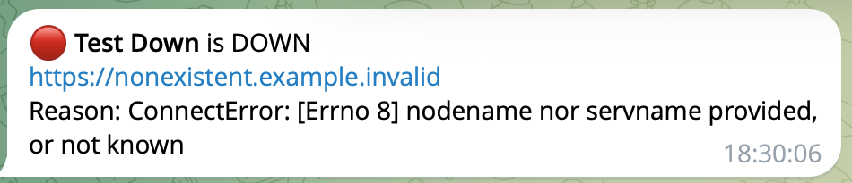

# uptime-monitor

[](https://github.com/Juspear/uptime-monitor/actions/workflows/ci.yml)


A lightweight asynchronous website uptime monitor that sends alerts to Telegram.

I build websites for freelance clients and needed to know when one of them goes down **before the client notices**. Paid monitoring services are overkill for a handful of small sites, so I wrote my own: one Python process, one config file, one dependency.

<p align="center">
  
</p>

When the site comes back, you get a recovery message:

```
🟢 Client Shop is back UP
https://shop.example.com
Downtime: 4m 30s
Response time: 212 ms
```

## Features

- **Async checks.** All sites are checked concurrently with `asyncio` + `httpx`, each on its own interval.
- **No false alarms.** A site is reported down only after N failures in a row (configurable), and you get exactly one alert per incident.
- **Recovery alerts** with total downtime and response time.
- **SSL expiry warnings.** Get a heads-up N days before a site's certificate expires (14 by default), once per certificate.
- **Content checks.** Optionally require a keyword on the page, which catches "200 OK but the page is broken" cases.
- **Custom expected status** (e.g. `204` for health endpoints).
- **One-shot mode.** `--once` checks everything (including certificates), prints a report and exits with code `1` if something is wrong, so it is handy for cron or CI.
- **Graceful shutdown** on Ctrl+C / SIGTERM.
- **Safe config.** Secrets live in environment variables, never in the config file.

## Quick start

```bash
git clone https://github.com/Juspear/uptime-monitor.git
cd uptime-monitor
pip install -r requirements.txt

cp config.example.toml config.toml   # then edit the list of sites
python -m uptime_monitor --once      # quick check
python -m uptime_monitor             # run continuously
```

Without Telegram credentials, alerts are printed to the console.

## Telegram alerts

1. Create a bot with [@BotFather](https://t.me/BotFather) and copy its token.
2. Send any message to your bot, then open `https://api.telegram.org/bot<TOKEN>/getUpdates` and find `"chat":{"id": ...}`.
3. Set the environment variables:

```bash
export TELEGRAM_BOT_TOKEN="123456:ABC..."
export TELEGRAM_CHAT_ID="123456789"
```

## Configuration

```toml
[defaults]
interval = 60               # seconds between checks
timeout = 10                # request timeout, seconds
failures_before_alert = 2   # failures in a row before a DOWN alert
ssl_expiry_warning_days = 14  # warn before the certificate expires (0 = off)

[[sites]]
name = "Client Shop"
url = "https://shop.example.com"
keyword = "Add to cart"     # optional

[[sites]]
name = "API health"
url = "https://api.example.com/health"
expected_status = 204
interval = 30
```

| Field | Default | Description |
|---|---|---|
| `name` | the URL | Name shown in alerts |
| `url` | required | Page to check (`http://` or `https://`) |
| `interval` | `60` | Seconds between checks (min 5) |
| `timeout` | `10` | Request timeout in seconds |
| `expected_status` | `200` | HTTP status that counts as "up" |
| `keyword` | none | Text that must appear in the response |
| `failures_before_alert` | `2` | Consecutive failures before alerting |
| `ssl_expiry_warning_days` | `14` | Warn this many days before the SSL certificate expires (`0` = off, `https://` only) |

## Running with Docker

```bash
docker build -t uptime-monitor .
docker run -d --restart unless-stopped \
  -v "$(pwd)/config.toml:/app/config.toml:ro" \
  --env-file .env \
  uptime-monitor
```

## How it works

```
                ┌──────────────┐
 config.toml ──▶│   Monitor    │  one asyncio task per site
                └──────┬───────┘
                       │ every `interval` seconds
                ┌──────▼───────┐
                │   checker    │  HTTP GET → CheckResult (ok, status, latency, error)
                └──────┬───────┘
                ┌──────▼───────┐
                │  SiteState   │  counts failures, detects DOWN / RECOVERED transitions
                └──────┬───────┘
                       │ only on a state change
                       │   (+ a separate SSL expiry check every 6 hours)
                ┌──────▼───────┐
                │   Notifier   │  Telegram (or console)
                └──────────────┘
```

| Module | Responsibility |
|---|---|
| `config.py` | Load and validate TOML config, read secrets from env |
| `checker.py` | Perform one HTTP check and classify the result |
| `state.py` | Per-site state machine that decides when to alert |
| `ssl_check.py` | Read a site's TLS certificate expiry date |
| `notifier.py` | Format messages and deliver them |
| `monitor.py` | Schedule concurrent checks, graceful shutdown |

## Tests

```bash
python -m unittest -v
```

The tests use `httpx.MockTransport`, so they never touch the network. They cover the checker, config validation, the alerting state machine, SSL expiry warnings, the monitor loop and the Telegram notifier.

## Roadmap

- [x] SSL certificate expiry warnings
- [ ] Store check history in SQLite
- [ ] Daily uptime summary in Telegram
- [ ] Simple web dashboard

## License

[MIT](LICENSE)
